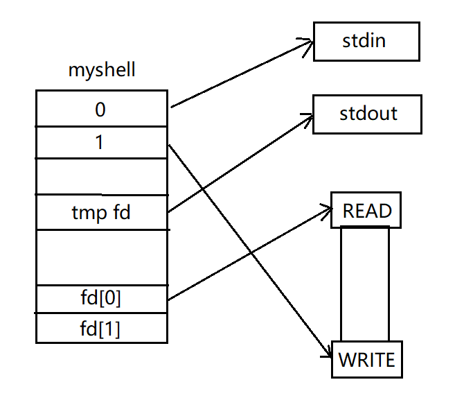
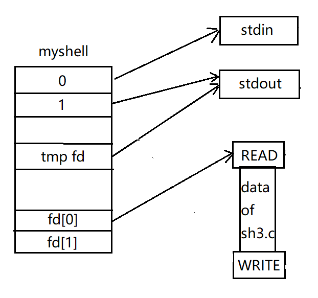

# 主要内容

在sh2.c基础上实现简单的管道功能（即`|`）

例：

```
#单独使用wc命令，输出显示sh3.c文件为324行
$>>>wc -l sh3.c
324 sh3.c

#"cat sh3.c"原本输出为sh3.c的内容
#通过管道将原本作为系统输出流的文件数据流转为“wc -l”的系统输入流
$>>>cat sh3.c | wc -l
324

#将“echo aaa”输出的“aaa”数据传输到“cat”，然后“cat”输出该数据
$>>>echo aaa | cat
aaa
```

**注**：

只考虑单个管道，即所有的输入的命令形式均为：

`command1 | command2`

其中`command1`向管道写数据，`command2`从管道读数据，且`command2`参数不完整，由管道提供输入数据

# 管道功能工作流程

1. 在父进程中使用`pipe(fd)`创建管道，`fd[0]`指向读端，`fd[1]`指向写端

   

2. 用临时文件描述符`tmp fd`“暂存”`stdout`，然后将输出重定向到管道写端。此时可关闭`fd[1]`

   

3. 用前面实现的`mysys`执行`command1`，此时创建的子进程，复制了父进程的文件描述符，因此执行结果被写入了管道

   

4. 子进程结束，将父进程输出恢复为临时文件描述符指向的`stdout`

   

5. 用临时文件描述符`tmp fd`“暂存”`stdin`，然后将输入重定向到管道读端。此时可关闭`fd[0]`

   

6. 接着用`mysys`执行`command2`，此时创建的子进程同样复制了父进程的文件描述符，从管道读端读取进程执行所需要的输入

   

7. 子进程结束，将父进程输入恢复为临时文件描述符指向的`stdin`，关闭临时文件描述符

   

# 解析管道符并创建管道

管道工作流程可简述为

   1. 创建管道
   2. 重定向输出
   3. 执行写命令（向管道写数据的命令）
   4. 恢复输出
   5. 重定向输入
   6. 执行读命令（从管道读数据的命令）
   7. 恢复输入

其中创建管道可在解析出管道符号后立即进行

而解析管道符的工作和重定向工作进行的时间可安排在一起

```c
//new command input
#define newCommand() {\
    do{\
        printf("\033[40;36m$>>>\033[m");\
        fgets(command, 81, stdin);\
        command[strlen(command)-1] = '\0';\
    }while(!command[0]);\
    rdFlag = redirect(command, filename, &tfd);\
    if (rdFlag == NO_RE)\
        ppFlag = pipeCheck(command, command2, fd);\
    strcpy(cmd, command);\
    strcpy(cmd, strtok(cmd, " "));\
}
//pipeCheck为新增的管道解析过程
```

定义

   ```c
#define PP_ERROR -1	//管道错误
#define NO_PP 0		//无管道
#define PP_WRITE 1	//待执行写命令
#define PP_READ 2	//待执行读命令
   ```

管道解析过程

```c
int pipeCheck(char* cmd, char* cmd2, int* fd){
    int i = 0;
    *cmd2 = '\0';
    char* tmp;

    for(;;i++){
        switch (*(cmd+i)){
            case '|':
                *(cmd+i) = '\0';
                if (*(cmd+i+1)){
                    //tmp = strtok(cmd+i+1, " ");
                    tmp = cmd+i+1;
                    if (tmp)
                        strcpy(cmd2, tmp);
                    else *cmd2 = '\0';
                }
                if (!*cmd2){
                    printf("Error: endline with '|'\n");
                    return NO_PP;
                }
                if (pipe(fd))	//创建管道
                    return PP_ERROR;	//创建失败则返回管道错误
                else
                    return PP_WRITE;	//创建成功则设置为写进程状态
            case '\0':  return NO_PP;
        }
    }
}
```

# 管道数据传输

大致思路为将输入的命令分为两部分，先执行第一部分（即写进程），然后跳过newCommand()过程，执行第二部分（即读进程）

执行前预处理和执行后恢复输入输出

```c
while(...){	//主循环
    //预处理
    switch (ppFlag){
        case PP_ERROR:  continue;
        case PP_WRITE:	//即将执行写进程，重定向输出
            tfd = dup(1);   //save stdout
            dup2(fd[1], 1);
            close(fd[1]);
            break;
        case PP_READ:	//即将执行读进程，重定向输入
            tfd = dup(0);   //save stdin
            dup2(fd[0], 0);
            close(fd[0]);
            break;
    }
    //....
    //执行过程
    //....
    //恢复过程
    if (ppFlag == PP_WRITE){
        //恢复输出
        dup2(tfd, 1);
        //解析command2
        strcpy(command, command2);
        strcpy(cmd, command);
        strcpy(cmd, strtok(cmd, " "));
        //切换为读进程状态
        ppFlag = PP_READ;
        //跳过下次输入命令的过程
        continue;   //if flag is PP_WRITE, use command2 as the next cmd
    }
    else if (ppFlag == PP_READ){
        dup2(tfd, 0);	//恢复输入
    }
    else
        unredirect(rdFlag, tfd);
    
    rdFlag = NO_RE;
    ppFlag = NO_PP;
}
```

至此整个shell的流程更新为

```c
init();
newCommand();	//新增了pipeCheck过程
cmdID = cmdCheck();
while(cmdID != 0){
    switch (ppFlag){
        case PP_ERROR:  continue;
        case PP_WRITE:	//即将执行写进程，重定向输出
            重定向输出;
            break;
        case PP_READ:	//即将执行读进程，重定向输入
            重定向输入;
            break;
    }
    
    if (rdFlag == NO_FILE){
    	is_NO_FILE();	
    }
    else{
        switch (cmdID){
            case 1:	mycd();break;
            case 2:	mypwd();break;
            default:	mysys();
        }
    }
    
    if (ppFlag == PP_WRITE){
        恢复输出;
        解析command2;
        切换为读进程状态;
        跳过本次newCommand()过程;
    }
    else if (ppFlag == PP_READ){
        恢复输入;
    }
    else
        unredirect();	
    
    newCommand();	//新增了pipeCheck过程
    cmdID = cmdCheck(cmd);
}
exit();
```

